# homework1

**電腦視覺特效HW1(第六組)**  
*107062539 資工碩1 蔡孟廷*  
*107062583 資工碩1 黃亭瑋*  
*107062563 資工碩1 蔡宸祐*  

1.Training cycleGAN  
  1. 在這次作業training的時候，我們這組所選擇的dataset為summer2winter_yosemite此組dataset，而training 200個epoch 所花費的時間總共26小時又11分半(如下圖進度條以及後面圖片所示)  
  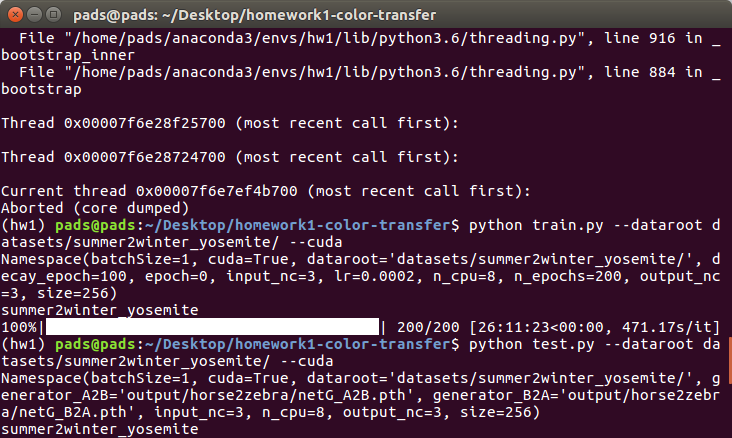  
    
  b. 以下附圖是training的過程中，會儲存的checkpoints檔案(含A to B 以及 B to A)  
  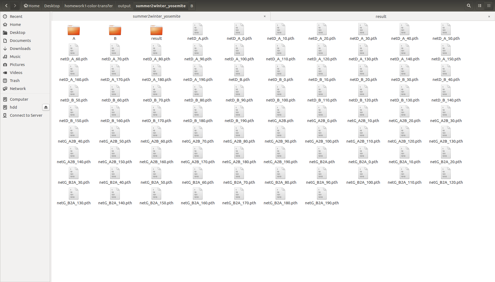  
    
  c. A to B testing的結果照片顯示(右邊為原圖，左邊為原圖轉成冬天的效果)  
  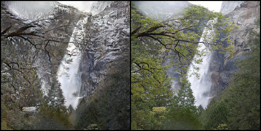  
  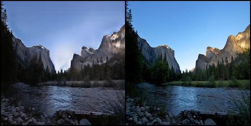  
  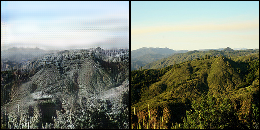  
  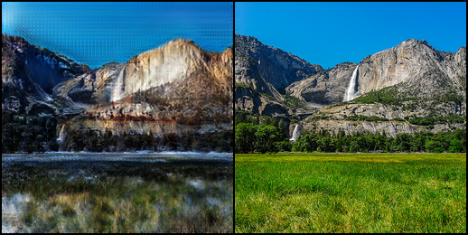  
  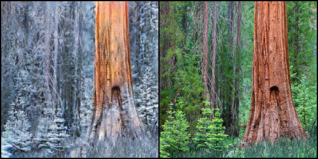  
  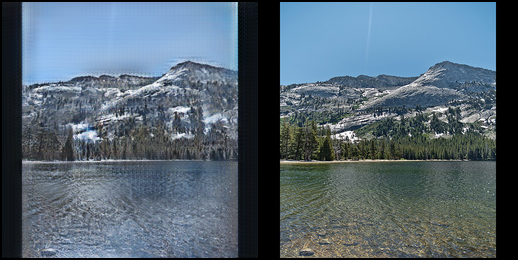  
    
  d. B to A testing的結果照片顯示(右邊為原圖，左邊為原圖轉成夏天的效果)  
  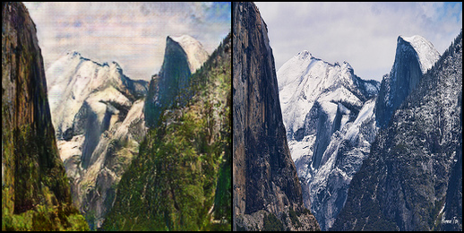  
    
  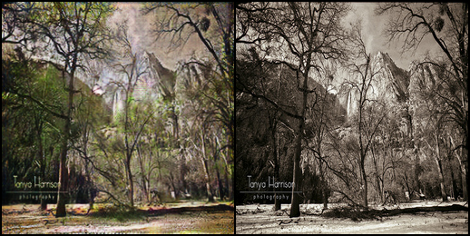  
  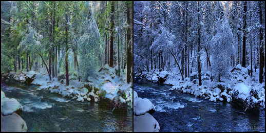  
  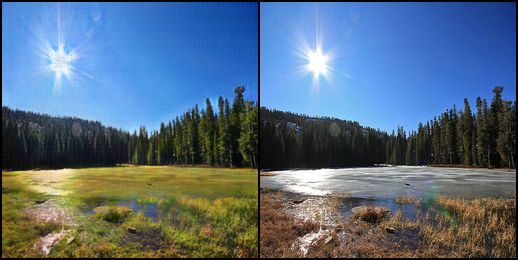  
  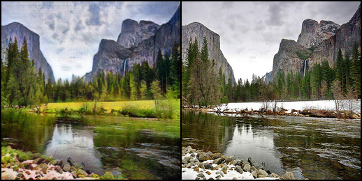  
    
2.Inference cycleGAN in personal image  
  a. 以下附圖為使用cycleGAN跑personal image的結果(右邊為原圖，左邊為reference成冬天的效果)  
  

