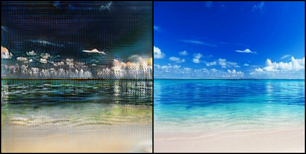
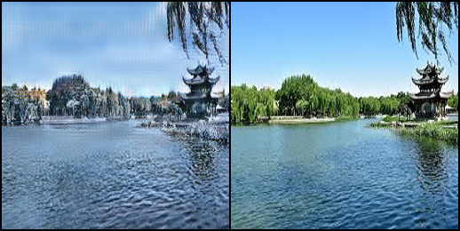
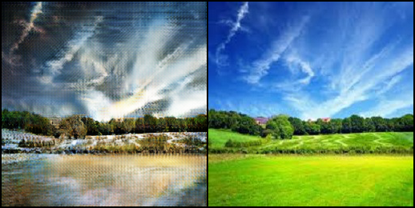
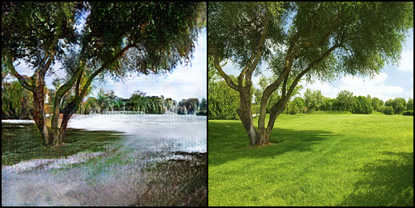
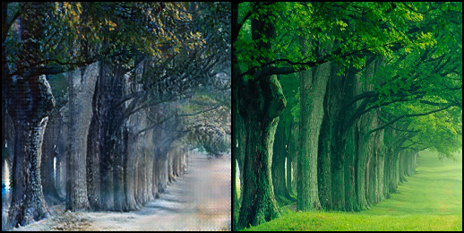
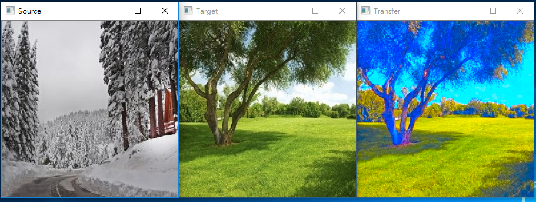
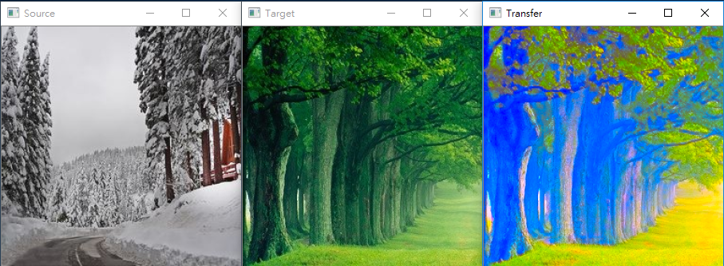
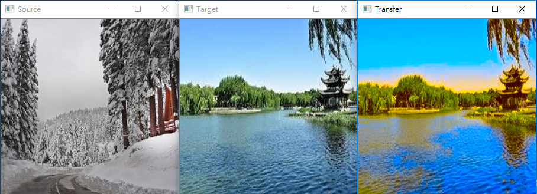
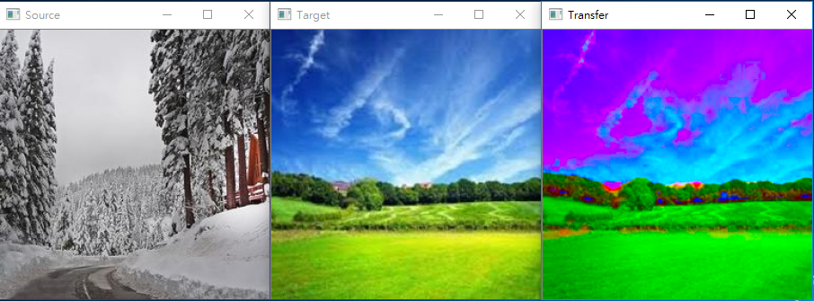

# homework1

**電腦視覺特效HW1(第六組)**  
*107062539 資工碩1 蔡孟廷*  
*107062583 資工碩1 黃亭瑋*  
*107062563 資工碩1 蔡宸祐*  

1.Training cycleGAN  
  - 在這次作業training的時候，我們這組所選擇的dataset為summer2winter_yosemite此組dataset，而training 200個epoch 所花費的時間總共26小時又11分半(如下圖進度條以及後面圖片所示)  
    
    
  - 以下附圖是training的過程中，會儲存的checkpoints檔案(含A to B 以及 B to A)  
    
    
  - A to B testing的結果照片顯示(右邊為原圖，左邊為原圖轉成冬天的效果)  
    
    
    
    
    
    
    
  - B to A testing的結果照片顯示(右邊為原圖，左邊為原圖轉成夏天的效果)  
    
    
    
    
    
    
    
2.Inference cycleGAN in personal image  
  - 以下附圖為使用cycleGAN跑personal image的結果(右邊為原圖，左邊為reference成冬天的效果)  
    
    
    
    
    
    
3. Compare with other method  
  以下為用相同personal images但使用https://www.pyimagesearch.com/2014/06/30/super-fast-color-transfer-images/?fbclid=IwAR1UBLo9s22NdKjOcK7Ie-_XKfu1qfTGfa1GiyezQOvk0qB8arPHDhaPD58 的演算法的結果  
  
    
    
    
    
    
    
  第一、二、三組結果圖片比對起來，cycleGan所 Inference出來的圖片，雖然有稍微模糊的顯示，但是整體來說卻可以讓人輕易得知這是冬天的照片且效果也相當不錯；然而透過github的color_transfer演算法所得出來的結果，背景顏色卻與原本預期出現白色的情況完全不同，反之出現了藍綠色的背景，而此圖片也能讓人一眼認出這並不是冬天的照片且這也不是正常景色的照片。  
  
  第四、五組結果圖片比對起來，cycleGan所 Inference出來的圖片就可以明顯得知冬天的效果並不明顯且模糊的更嚴重，然而對比於github演算法所得出的結果，卻反而並沒有相對嚴重，因為github的color_transfer演算法所show出來的結果更為誇張—背景天空出現紫色這種異常的顏色。  
  
  是故透過上述五組圖片來比對cycleGAN以及color_transfer演算法後，我們認為cycleGAN在整體圖片的Inference後所呈現的結果完整度，會比github的color_transfer演算法穩定許多，雖然在github的作者有show出該演算法在其他圖片也有不錯的效果，但吾輩認為cycleGAN就整體性而言robust許多。

  
  
  

